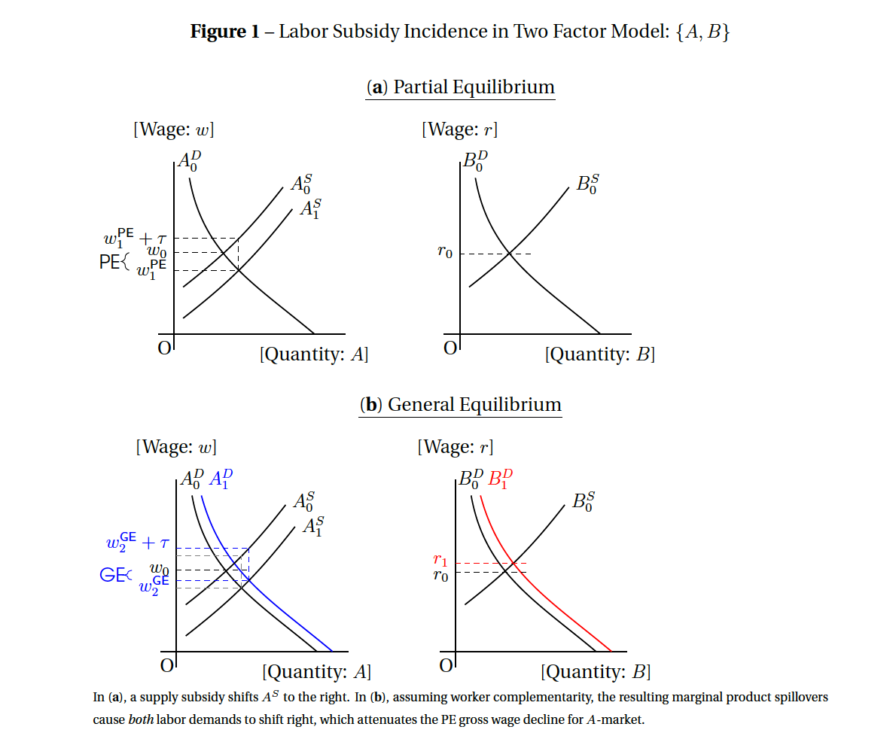

## Favorite Graph

```{r echo=FALSE}

```


## Important links

- [Paper](watson_geeitc.pdf)
<!-- - [Appendix (preprint)](chaudhry-dotson-heiss-who-cares-crackdowns-appendix.pdf) -->
<!-- - [Statistical analysis notebook](https://stats.andrewheiss.com/who-cares-about-crackdowns/) -->
<!-- - [GitHub repository](https://github.com/andrewheiss/who-cares-about-crackdown)
- [Experiment preregistration](https://osf.io/hsbyd) (research question #2) -->


## Abstract

The Earned Income Tax Credit is a $67 billion tax expenditure that subsidizes 20% of all workers. Yet all prior analysis uses partial equilibrium assumptions on gross wages. I derive the general equilibrium incidence of wage subsidies and quantify the importance of EITC spillovers in three ways. I calculate the GE incidence of the 1993 and 2009 EITC expansions using new elasticity estimates. I contrast the incidence of counterfactual EITC and Welfare expansions. I quantify the effect of equalizing the EITC for workers with and without children. In all cases, I find spillovers are economically meaningful.


## BibTeX citation

```bibtex
@techreport{watson_geeitc:2021,
    Author = {C. Luke Watson},
    Month = {9},
    Title = {The General Equilibrium Incidence of the Earned Income Tax Credit},
    Type = {Manuscript},
    Year = {2021}}
```
