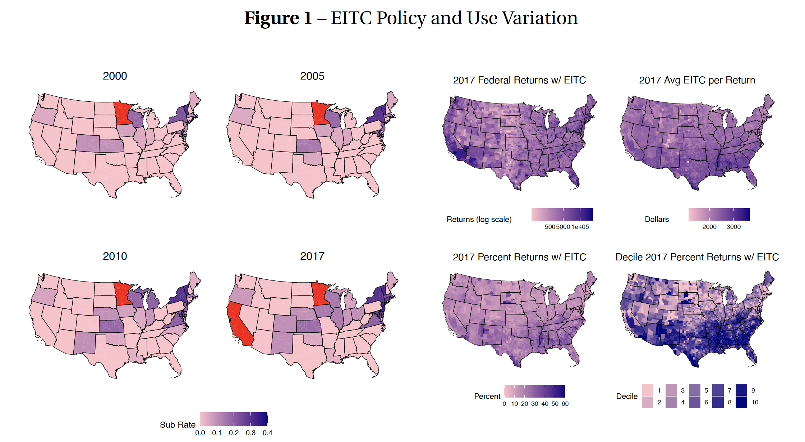
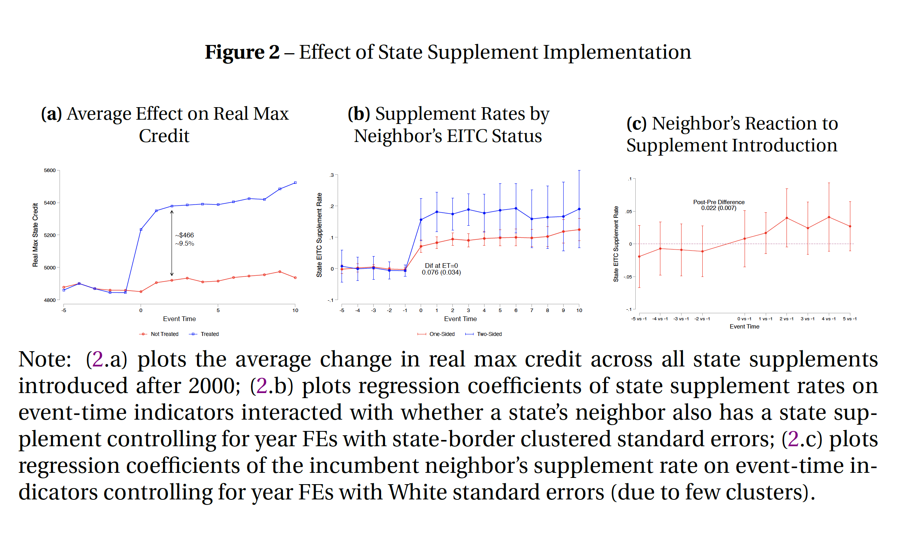

## PDF links

- [Paper](watson_state_eitc.pdf)
<!-- - [Appendix (preprint)](chaudhry-dotson-heiss-who-cares-crackdowns-appendix.pdf) -->
<!-- - [Statistical analysis notebook](https://stats.andrewheiss.com/who-cares-about-crackdowns/) -->
<!-- - [GitHub repository](https://github.com/andrewheiss/who-cares-about-crackdown)
- [Experiment preregistration](https://osf.io/hsbyd) (research question #2) -->


## Abstract

Twenty eight states spend $4 billion to supplement the federal Earned Income Tax Credit, with several justifying the tax expenditure as a pro-work incentive. Yet no systematic evaluation of these supplements exists. I use state border policy variation to identify state supplements effects. I first document that subsidy rates are greater when a state’s neighbor already has a supplement. Next, I assess whether supplements affect county level EITC take-up, migration, commuting, employment, and earnings. Estimates are sensitive to the estimation design and sample used. While supplements increase benefits to low-income workers, results fail to provide robust evidence of increased economic activity.

**Note: the empirics on this paper are not finalized and should not be cited.**

## Graph from the paper

### Timing and intensity of use

```{r echo=FALSE}

```

### Possible policy coordination

```{r echo=FALSE}

```


## BibTeX citation

```bibtex
@techreport{watson_state_eitc:2021,
    Author = {C. Luke Watson},
    Month = {8},
    Title = {The Local Effects of State EITC Expansions},
    Type = {Manuscript},
    Year = {2021}}
```
